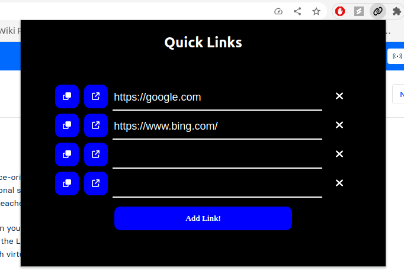

# Quick Links Chrome Extension

## How to Build a Chrome Extension using React in Typescript

### React Setup:

1.  Create a new React project

```
npx create-react-app app-name --template typescript
```

-   Run this in a terminal replacing app-name with the name of your app
-   Feel free to clear out the contents of App.tsx and App.css to start with a clean slate

2. Build the app

-   Run this command in your terminal to build the app

```
npm run build
```

-   This should create a build folder with your compiled app

### Chrome Setup

-   In app-name/public/ create a manifest.json file

-   To start it can look something like this

```
    {
        "name": "App-Name",
        "description": "This is my app",
        "version": "1.0",
        "manifest_version": 3,
        "action": {
            "default_popup": "index.html",
            "default_title": "Open the popup"
        },
        "icons": {
            "16": "logo192.png",
            "48": "logo192.png",
            "128": "logo192.png"
        }
    }
```

-   Check out the [Chrome Developer Docs](https://developer.chrome.com/docs/extensions/mv3/manifest/) for more info on each key

### Add the Extension to your local chrome browser

1. Open a Chrome browser and open a new tab to [chrome://extensions/](chrome://extensions/)
2. If you haven't already switch on developer mode in the top right
3. Then click the "Load Unpacked" button in the top left
4. This should open a file explorer and you want to open app-name/build/
5. The extension should show up on your list now and in your extensions popup

## Building Quick Links

### Main App



-   index.tsx

    -   Chrome extensions can't rely on a root element always being available so here we will create a div with our
    https://github.com/serose99/quicklinks/blob/1da9f074a894a72e1e4dcbe75a30368310a32c5e/src/index.tsx

-   index.css

    -   This defines the dimensions of the actual popup
    https://github.com/serose99/quicklinks/blob/88e765ddb7f8aff3c4385b87ce2264f31d67aa87/src/index.css

-   App.tsx

    -   The first thing we want to do is create 2 state variables to hold the list of links and the currently copied link
        https://github.com/serose99/quicklinks/blob/88e765ddb7f8aff3c4385b87ce2264f31d67aa87/src/App.tsx#L6-L7
    -   Then we will use React's useEffect hook to load in our links. 2 things to note here 
        1. useEffect allows our app to load data on initial load and/or when a value in the dependencies is changed. For this specific case we will noy list any dependencies as we only need to run this once. Check out the [docs](https://react.dev/reference/react/useEffect) for more info. 
        2. chrome.storage.local is chrome's way of letting developers store data locally in their chrome sessions. If you'd like you can also use chrome.storage.sync to sync your links list across browsers instances. Check out the [docs](https://developer.chrome.com/docs/extensions/reference/storage/) for more info.
    https://github.com/serose99/quicklinks/blob/88e765ddb7f8aff3c4385b87ce2264f31d67aa87/src/App.tsx#L9-L15
    -   Next we will add 2 helper methods for storing our links locally once they have been entered as well as adding new rows for more links
        https://github.com/serose99/quicklinks/blob/88e765ddb7f8aff3c4385b87ce2264f31d67aa87/src/App.tsx#L17-L25
    -   Then we will declare our callbacks for the Links component which gives it access to it's parent classes links property.
    https://github.com/serose99/quicklinks/blob/88e765ddb7f8aff3c4385b87ce2264f31d67aa87/src/App.tsx#27-70
    -   And finally we will declare return our component
    https://github.com/serose99/quicklinks/blob/88e765ddb7f8aff3c4385b87ce2264f31d67aa87/src/App.tsx#72-104

-   App.css
https://github.com/serose99/quicklinks/blob/93d78bbc49b91e832db941153d3bb89795ee650d/src/App.css

-   Link.tsx

    -   interface LinkProps
        -   To pass through the link id and callbacks we will use a new interface LinkProps as the type for the parameter for this component
    https://github.com/serose99/quicklinks/blob/93d78bbc49b91e832db941153d3bb89795ee650d/src/Link.tsx#L50-L57
    -   Here each row is a simple div container with 2 buttons for the copy and launch link, an input for the link, and then another button for the delete link. Each of these onClick will call their respective callbacks so the parent can manipulate the links array as needed
    https://github.com/serose99/quicklinks/blob/93d78bbc49b91e832db941153d3bb89795ee650d/src/Link.tsx#L10-L48

-   Link.css
    https://github.com/serose99/quicklinks/blob/93d78bbc49b91e832db941153d3bb89795ee650d/src/Link.css

That's it as far as app content. If you completed the original setup you should be able to run `npm run build` and now see popup in chrome! However you may notice the links won't persist after closing the popup, we will make some additional changes to the manifest.json to enable this. 

### Chrome 

- manifest.json
    - In here we will add the 'permissions' key which is a list of:
        - storage; to allow our app to access the chrome storage functionality
        - tabs: to allow our app to update the tabs in the session
        - clipboardWrite: to allow our app to copy the links to the clipboard
    https://github.com/serose99/quicklinks/blob/aca6e52cfb69784feb0b66dd900e244f6b2912c3/public/manifest.json
    Check out all of the available permissions [here](https://developer.chrome.com/docs/extensions/mv3/declare_permissions/)

And thats it, you should now have a working Chrome Extension!

If this helped you in any way or you like the idea, feel free to star the repo! Thanks!